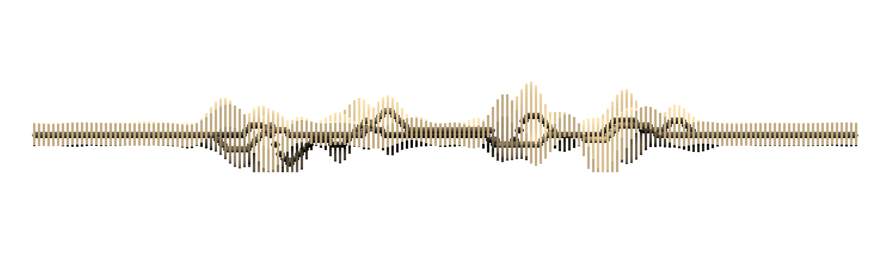
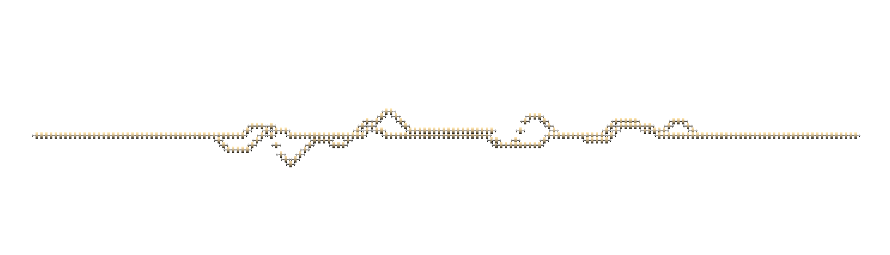
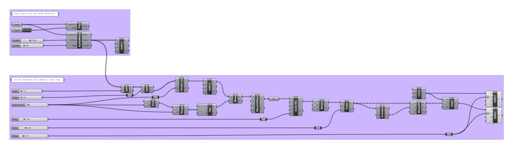

[](https://creativecommons.org/licenses/by/4.0/)

# Waveforms


---

## Contents
1. [**Poemform**](#poemform)
    1. [Diamonds in Dystopia](#diamonds-in-dystopia)
    1. [Generative Design](#generative-design)
    1. [Digital Fabrication](#digital-fabrication)
1. [**Loveform**](#loveform)
    1. [Generative Design](#generative-design)
    1. [Digital Fabrication](#digital-fabrication)
    1. [Ceramics](#ceramics)

## Poemform
Poemform is an interactive bench derived from the waveform
of the poem Diamonds in Dystopia.
Embedded surface transducers so that it becomes a sound system,
the bench will play a different line of poem
depending upon where you sit.

**Team:** Brendan Harmon, Hye Yeon Nam, Anca Matyiku, Vincent Celluci, and Zak Berkowitz.

### Diamonds in Dystopia
Three lines from Vincent Celluci's poem
[Diamonds in Dystopia](#poeform/text/diamonds-in-dystopia.txt):

```
irrigating minds

the one prototype for change
   more giving systems
```

### Generative Design
...






### Digital Fabrication
...

## Loveform
Loveform is an interactive, 3D printed ceramic cup
derived from the waveform of a message.
The cups recites its recorded message when it is drunk from.
The first pair of cups represents and recites the message:
> I love you.  

**Team:** Hye Yeon Nam and Brendan Harmon.

### Generative Design




### Digital Fabrication
...

### Ceramics
...

---

## License
Licensed CC BY-SA 4.0
by Brendan Harmon, Hye Yeon Nam, et al.
The license does not apply to logos, fonts, linked material, data, quotations,
or reprinted images by other authors, which may have different licenses.
The fonts used in this repository are licensed under the SIL Open Font License
by their authors.
